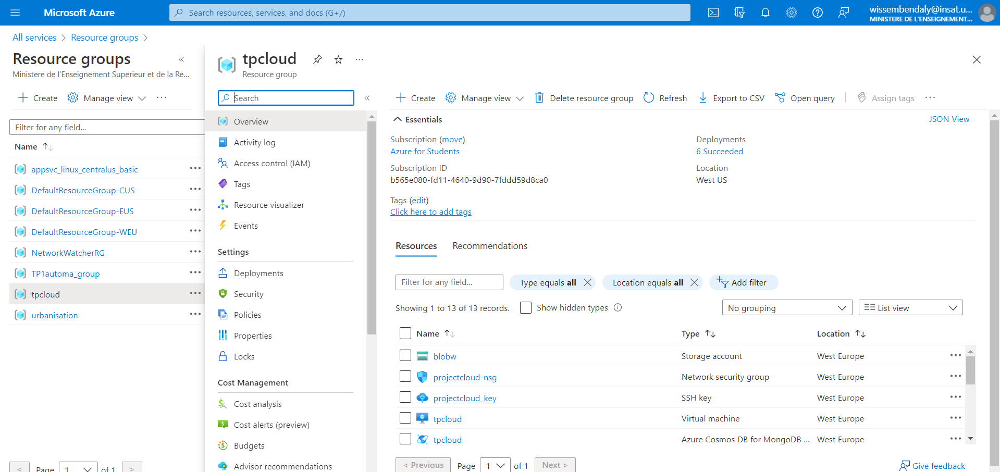
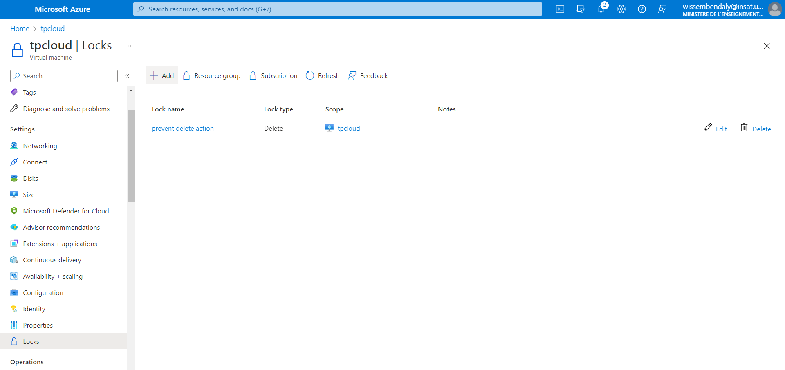
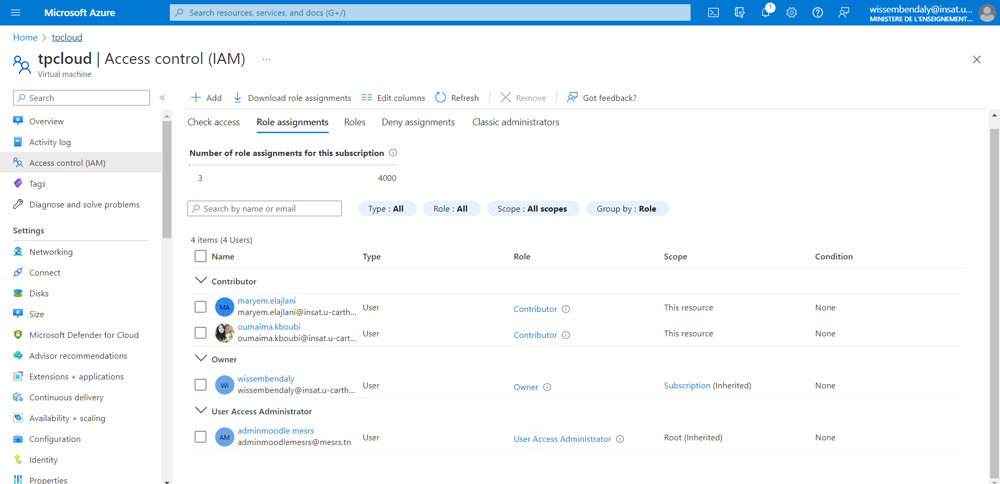
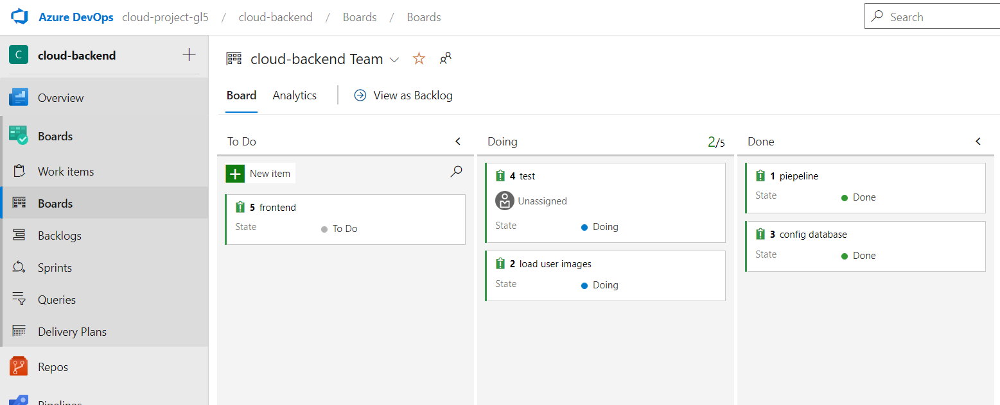
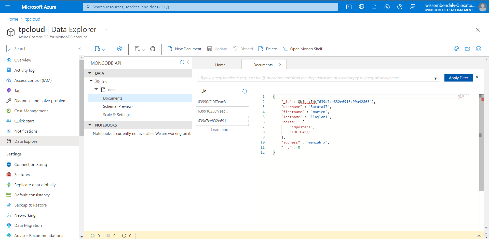
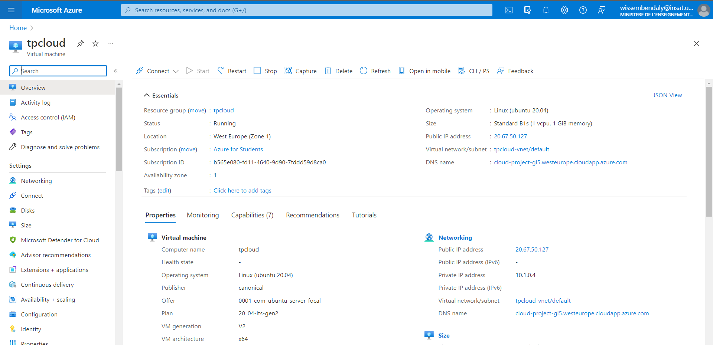
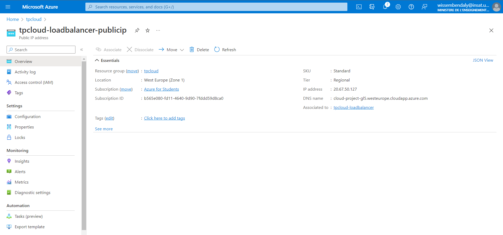
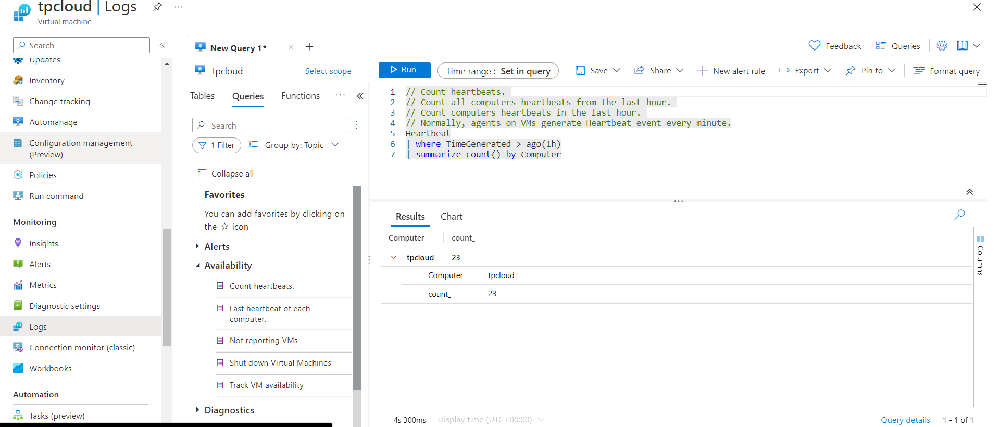
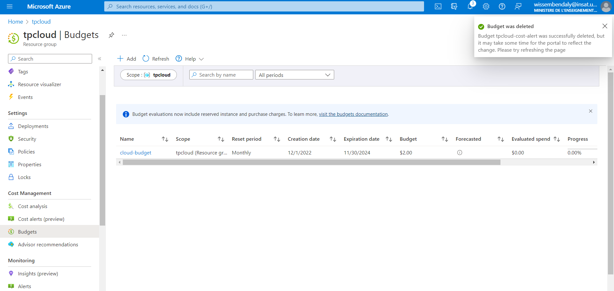

# Azure cloud computing project - TodoApp

- This project was made by Wissem Ben Daly, Oumaima Kboubi and Mariem El Ajlani
- We created a small app that allows any company to organize it's staff. The app allows you to create and save a list of users.
- We used Microsoft Azure to develop and deploy the app using multiple services:
    - Virtual Machine
    - Load Balancer 
    - Azure IAM
    - Azure Cosmos DB
    - Azure pipelines
    - Azure DevOps
    - Cost Management
    - Azure monitor (Application insights,Key Metrics)
    - Azure Biling

## Architecture

- This is the architecture of the deployment in Azure.

## Azure Services
We will now explain how we used each azure service.

### Ressource Groups
- Every ressource was created inside a single ressource group.
- We chose France Central as the Region for our ressources.
- We used tags to save metadata of our ressources and to facilitate their search. 

- We also secured the group with a delete ressource lock to avoid accidental deletion.

### resource Lock 
We also secured the group with a delete ressource lock to avoid accidental deletion.

### Azure IAM (Identity and Access Management)
- We used this service to add users to the subscription and manage the roles.
- We have 1 user as owner and 1 user as contributor.

### Azure DevOps
- We used it to organize our work into tasks.
- We also used the integrated repository as a remote code repository for our app.

### Azure Pipelines
- We used this service to automatically build the app into an image and deliver it to an Azure Contrainer registry.
- It creates the necessary .yml file for the build pipeline.

<!-- ### Azure Container Registry
- We created a container registry that will hold the app image and from where we will deploy the app.
- We used the standard pricing plan with 100 GB available.

 -->

### Azure Cosmos DB
- We used a NoSQL database with Azure Cosmos DB which holds a tasks collection.
- The connection string was updated into our app.
- We pay on the go depending on the number of request units.

### Azure Virtual Machine 
- We deploy the image from our Azure Container Registry into a web app service.
- After few seconds, the URL is available and we can use the app.
- We used a free tier Linux App service plan that gives us the ability to scale up the app when needed.
 

### Azure Virtual Machine 
Azure virtual network enables Azure resources to securely communicate with each other, the internet, and on-premises networks. Key scenarios that you can accomplish with a virtual network include - communication of Azure resources with the internet, communication between Azure resources, communication with on-premises resources, filtering network traffic, routing network traffic, and integration with Azure services.

### Load Balancer 
- We added a load balancer
- This will forward the upcoming requests to the Virtual Machine.
 

### Azure monitor 
- We added the following services which help us observe and monitor our application 

 #### Logs 

 
 #### Key Metrics
  
 
 
 ### alert rules
  

### Budget
We can specify budget and set rules to notify us when reaching a specific usage percentage
  

### Azure Storage account
the sotage account contains the images we pushed and our app uses
 

